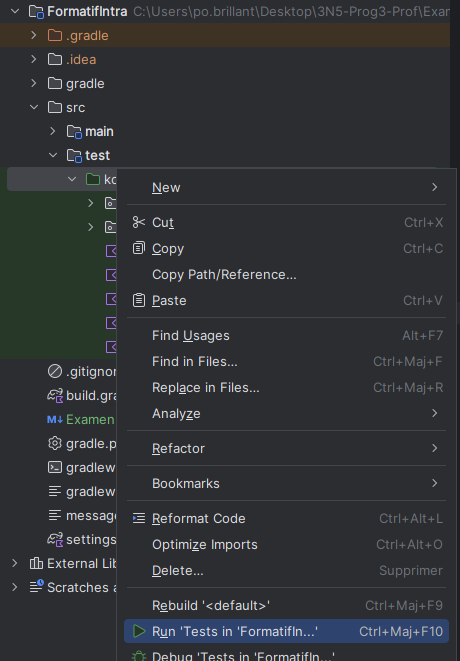

# Examen Intra - Automne 2024

## Durée de l'examen

100 minutes (135 minutes si CSA)

## Instructions

- Plusieurs fonctions sont fournies dans `src/main/kotlin`. Tu dois lire les commentaires et remplir les fonctions selon ce qui est demandé.
- Tu dois remplacer la chaîne de caractères "Ton nom à toi" qui est dans `src/main/kotlin/TonNom.kt` par ton nom et ton prénom.
- Toute documentation hors ligne est permise (aucun accès internet).
- Aucun écouteur n'est permis pendant l'examen.
- Si tu es pris.e à accéder à internet (en dehors des liens permis) ou à copier sur un.e voisin.e, tu auras la note de 0.
- L'enseignant ne peut t'aider que si tu as des problèmes avec ton environnement de développement.
- Il est interdit d'utiliser toute assistance venant d'une intelligence artificielle sous peine de note 0.

## Liens permis

- https://info.cegepmontpetit.ca/3N5-Prog3/intraA24-2.html
- https://kotlinlang.org/docs
- https://github.com/departement-info-cem/3N5-Prog3
- https://info.cegepmontpetit.ca/3N5-Prog3/

## Exécuter les tests

Il est possible d'avoir une correction non-officielle de l'examen.

1. Pour exécuter la suite de tests, ouvre le répertoire `src/test`.
2. Clique-droit sur le dossier kotlin.
3. Run 'Tests in 'FormatifIntra'.

Un fichier nommé correction.md va être généré, qui contient ta note sommaire.
